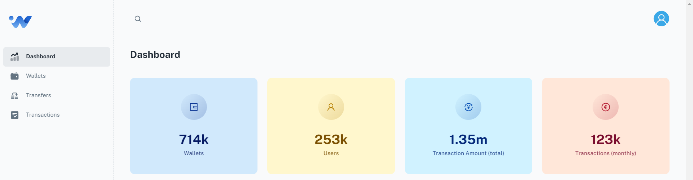

## e-wallet 
Full stack web app with React and Spring Boot used for managing digital wallet and transactions.

<br/>



<br/>


<br/>

### Description
This application, allows users to implement an e-wallet with REST API to create and top it up, check its balance, and withdraw. 
Users can register and log_in using the credentials. They can also add any wallets for any account provided by IBAN 
and transfer to their own wallet or any other wallet that is defined in the system.

The application has custom IBAN validators that can easily be applied to any IBAN field via annotation as shown below:

```
@ValidIban(message = "{iban.valid}")
private String iban;
```

<br/>


<br/>


<br/>

### Architecture

The relationship between the entities is shown on Architecture 
<br/>

### Getting Started

To run & test application, see details on [How to run?](backend/src/main/resources/docs/how_to_run.md) and [How to test?](backend/src/main/resources/docs/how_to_test.md) sections.

<br/>

### Dependencies

* Spring Boot
* Spring Web
* Spring Security
* Spring Data JPA
* Lombok package 
* MapStruct
* PostgreSQL
* Flyway
* React
* Node.js
* Material UI

<br/>

### Documentation
[Spring Boot](https://docs.spring.io/spring-boot/docs/current/reference/htmlsingle/)<br/>
[Spring Security](https://docs.spring.io/spring-security/reference/index.html)<br/>
[Spring Data JPA](https://docs.spring.io/spring-data/jpa/docs/current/reference/html/)<br/>
[springdoc-openapi v2](https://springdoc.org/v2/)<br/>
[MapStruct](https://mapstruct.org/)<br/>
[JUnit 5](https://junit.org/junit5/docs/snapshot/user-guide/)<br/>
[Entity Relationship Diagram (ERD)](https://www.lucidchart.com/pages/er-diagrams)<br/>
[React](https://react.dev/)<br/>
[Material UI](https://mui.com/)<br/>
[Notistack](https://notistack.com/features/basic)<br/>
[Register of countries using the IBAN standard](https://www.iban.com/structure)<br/>

<br/>

### Version History

* v1.0.0 Initial Release base 

<br/>
<br/>
